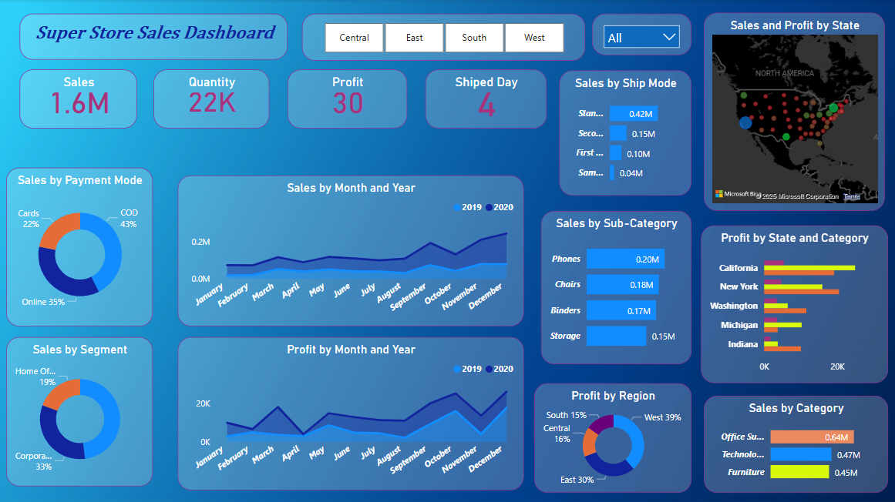

# 📊 Super Store Sales Dashboard



## 📝 Overview
This dashboard presents a comprehensive view of sales, profits, shipping modes, payment preferences, and regional performance for a retail superstore over two years (2019-2020). It is designed to offer quick insights to stakeholders for data-driven decision-making.

---

## 🔍 Key Insights

### 📈 General Performance
- **Total Sales**: $1.6M  
- **Total Profit**: $30K  
- **Total Quantity Sold**: 22K Units  
- **Average Ship Day**: 4 Days  

---

### 💳 Sales by Payment Mode
- COD: 43%  
- Online: 35%  
- Cards: 22%  
💡 *Insight*: COD dominates, indicating a preference for post-payment methods.

---

### 👥 Sales by Segment
- Corporate: 48%  
- Consumer: 33%  
- Home Office: 19%  
💡 *Insight*: Corporate buyers are key customers — target retention strategies here.

---

### 📅 Monthly Trends
- **Peak Sales**: October to December  
- **Profit Peak**: November and December  
💡 *Insight*: Holiday/Q4 performance is significantly stronger — consider seasonal campaigns.

---

### 🚚 Shipping Preferences
- Standard Class is most preferred (0.42M in sales).  
💡 *Insight*: Customers prefer economic delivery — optimize standard shipping services.

---

### 🔧 Top Performing Sub-Categories
- Phones: $0.20M  
- Chairs: $0.18M  
💡 *Insight*: Tech and office furniture drive category-level success.

---

### 🗺️ Regional Insights
- Top Regions: West (39%), East (30%)  
- Top States: California, New York  
💡 *Insight*: Focus marketing and logistics in high-performing areas.

---

### 🗃️ Category-Wise Sales
- Office Supplies: $0.64M  
- Technology: $0.47M  
- Furniture: $0.45M  
💡 *Insight*: Office supplies dominate in volume; technology and furniture hold value.

---

## 🎨 Dashboard Design Features

- **Clean UI** with a blue gradient theme  
- **Interactive Filters** for Region and Time  
- **Combination of Donut, Bar, and Line Charts** for better readability  
- **Map View** to assess geographic performance  
- **Monthly Comparative Lines** for trend visualization  

---

## 📌 Recommendations

1. Focus on **COD optimization** and delivery experience.  
2. Run **year-end promotions** in Q4 to capitalize on seasonal sales.  
3. Expand in **West and East regions**, especially in **California and New York**.  
4. Push high-selling sub-categories like **Phones** and **Chairs** with bundles.  
5. Retain corporate clients with loyalty programs or B2B offers.  

---

## 📂 Folder Structure

```bash
project/
├── README.md
├── dashboard.png
├── insights_notes.txt
├── design_outline.pptx (optional)
