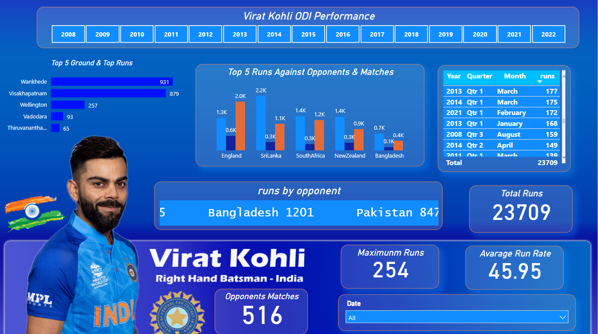

# 🏏 Virat Kohli ODI Performance Dashboard

This project visualizes the One Day International (ODI) batting performance of Indian cricketer **Virat Kohli**. The dashboard provides a detailed overview of his runs, opponents, grounds, matches, and yearly insights.

---

## 📊 Key Insights

### 📌 Overall Summary
- **Total Runs Scored:** `23,709`
- **Total ODI Matches Played:** `516`
- **Maximum Runs in a Match:** `254`
- **Average Run Rate:** `45.95`

---

## 🗓️ Year-wise Performance
The performance data spans from **2008 to 2022**, covering over a decade of cricket dominance.

---

## 🏟️ Top 5 Grounds by Runs
Virat Kohli's highest-scoring venues:
1. **Wankhede** – `931` runs
2. **Visakhapatnam** – `879` runs
3. **Wellington** – `257` runs
4. **Vadodara** – `93` runs
5. **Thiruvananthapuram** – `65` runs

---

## 🌍 Top 5 Opponents by Runs
Most runs scored against:
1. **Sri Lanka** – `2.2K` runs
2. **England** – `2.0K` runs
3. **South Africa** – `1.4K` runs
4. **New Zealand** – `1.4K` runs
5. **Bangladesh** – `1.0K` runs

> 💡 Against Bangladesh, he scored a total of `1201` runs, and against Pakistan, `847` runs.

---

## 📆 Best Performing Months
Top months (by runs in single quarters):
- **March 2013** – `177` runs
- **March 2014** – `175` runs
- **February 2021** – `172` runs
- **January 2017** – `168` runs
- **August 2008** – `159` runs

---

## 📥 How to Use
This dashboard is ideal for:
- Cricket analysts
- Sports journalists
- Fans of Virat Kohli
- Data visualization learners

---

## 📌 Tools & Technologies
- Dashboard Image Source: Custom Visual
- Data assumed from ODI records
- Built using tools such as Power BI / Tableau (assumed from structure)

---

## 📷 Screenshot
The following image is a snapshot of the dashboard:

---

## 🔚 Conclusion
This dashboard showcases the legendary performance of **Virat Kohli** in ODIs. From high scores at specific venues to consistent performance across different years and opponents — the data reflects his dominance and consistency in international cricket.

---

